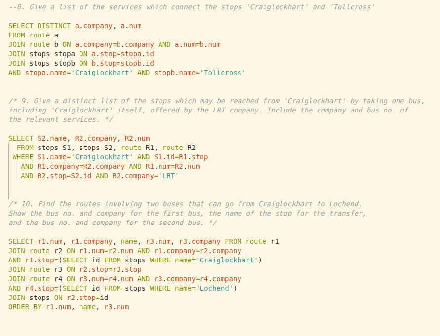

# This repository contains answers to all of the SQL Zoo's problems

 

  

  <h3 align="center">SQL Zoo Project</h3>

  

    This project is part of the Microverse Database SQL curriculum
     
    <a href="https://github.com/guirecordon/sql_zoo"><strong>Explore the docs »</strong></a>
     
     
    <a href="https://github.com/guirecordon/sql_zoo/issues">Report Bug</a>
    ·
    <a href="https://github.com/guirecordon/sql_zoo/issues">Request Feature</a>
  

## Table of Contents

* [Usage](#usage)
* [Comments](#comments)
  * [Built With](#built-with)
* [Author](#author)
* [Show Support](#show-your-support)
* [Acknowledgements](#acknowledgements)

## Usage

This repository simply contains the answers to all of the exercise problems proposed on the SQL Zoo webpage. 

You'll find the page to the tutorial [here](https://sqlzoo.net/).

## Comments

This is not a comprehensive tutorial of SQL, but it does present some interesting challenges, especially around JOINs and self JOINs.

The one on self JOINs is the most challenging and I might wright an article about it in the near future. I'll update it here onced it is published. 

### Built With
* SQL

## Author
👤 **Guilherme Recordon** 

- Twitter: [@guirecordon](https://twitter.com/guirecordon) 
- Github: [@guirecordon](https://github.com/guirecordon)
- LinkedIn: [@GuilhermeRecordon](www.linkedin.com/in/gui-recordon-marketingmba/)

## Show your support

Give a ⭐️ if you like this project!

## Acknowledgements

I've always had a lot of fun with SQL. This time around wasn't different, especially when working together with ezeilo-su and rodolforecordon, cracking our heads, trying to make sense of the London bus system tables!

